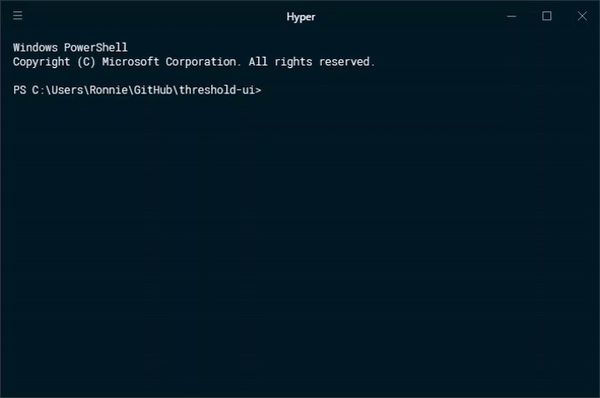

# git-shell

*Not to be confused with the git command [git-shell](https://www.google.co.uk/url?sa=t&rct=j&q=&esrc=s&source=web&cd=1&cad=rja&uact=8&ved=0ahUKEwidzqTu-f3ZAhUrKcAKHY6VDI8QFggpMAA&url=https%3A%2F%2Fgit-scm.com%2Fdocs%2Fgit-shell&usg=AOvVaw2uXwTjN4IjWFd7LP-Kovfm)*

## Background

GitHub for Windows used to ship with a shortcut called Git Shell, which would launch PowerShell with the posh-git module. However, it no longer does, and there are [no plans to do so in the future](https://github.com/desktop/desktop/issues/340). I wrote this couple of scripts to create a command line shortcut to run posh-git, replicating the Git Shell experience (although without the physical start menu tile). It does however, allow for loading posh-git to an existing console.

## Installation

### Prerequisites

- Git must be installed and available via the PATH environment variable
  - Check that git is accessible from PowerShell by executing `git --version` from PowerShell
  - If git is not recognized as the name of a command, verify that you have Git installed
  - If Git is not installed, download it from [git-scm.com/download/](https://git-scm.com/download/)

- Posh-git must be installed
    - If you have previously installed the old version of GitHub for Windows, it will be in the `%LOCALAPPDATA%\GitHub` folder
        1. Open File Explorer and type `%LOCALAPPDATA%\GitHub`
        1. One of the folders will be called `PoshGit_XXXXXXXXXXXXXXX` with a log string of alphanumerics. Keep this folder open for now.
    - If not, go to [the posh-git repo](https://github.com/dahlbyk/posh-git) and follow the installation instructions
     
### Instructions

1. Get the scripts. Either:
    - Download the two scripts `git-shell.cmd` and `git-shell-ps.ps1` to a folder called "git-shell" in your user directory (or a custom location)
    - Or cd to your user directory (or a custom location) and clone the repo there. You should then delete `README.md`, `LICENCE` and `demo.gif`.

1. Right click `git-shell-ps.ps1` and click `Edit`
    1. In the line `Import-Module $env:LOCALAPPDATA\GitHub\PoshGit_XXXXXXXXXXXXXXXXXXXX\posh-git.psm1`, change the filepath to your posh-git installation
    1. Set the default location to navigate to when `git-shell` is called without the parameter `-here` by changing the line `cd ~\GitHub\` as appropriate. If you want to remain in the current directory when `git-shell` is called, delete the if-block.
    
1. Add the git-shell folder to your PATH
    1. In Windows settings, search for "System environment" and click `Edit the system environment variables`
    1. Click the `Environment Variables...` button near the bottom
    1. Under either User variables or System variables, click on the `Path` variable and then click `Edit...`
    1. Click `New` and type in the location of your `git-shell` folder (e.g., `%USERPROFILE%\git-shell`)
    1. Click `Ok` etc.
    
## Usage

    > git-shell
    
Loads git-shell and navigates to your default folder (`~\GitHub\` if you haven't changed it)

    > git-shell -here

Loads git-shell in the current directory

To change this behaviour, edit `git-shell-ps.ps1`. Do not edit `git-shell.cmd` unless you want to extend it (in which case why not create a fork of this repo).

## Notes

If it keeps asking for a password to push changes to GitHub while using git, check out [Git Credential Manager for Windows](https://github.com/Microsoft/Git-Credential-Manager-for-Windows)
